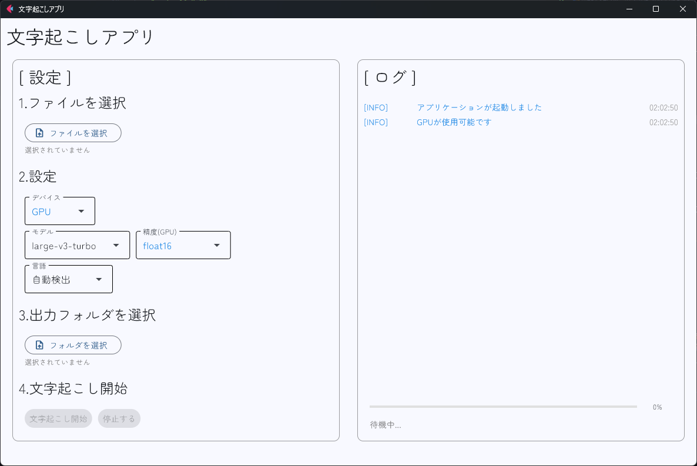

# whisper-app


## これは何？
文字起こしをローカルで簡単にできるアプリです。
whisperを使って文字起こし、Fletを使ってGUIを作っています。

## 使い方
(必要に応じて)uvをインストール
参考 : https://docs.astral.sh/uv/

依存関係をインストール
```bash
uv sync
```

仮想環境を有効化した後

```bash
python app/main.py
```

で実行できます。

## 出力形式
出力形式は、txtファイルで以下のような形式で保存されます。

```
[0.00s -> 5.00s] Hello, world!
[5.00s -> 10.00s] This is a test.
...
```

## GPU を使う場合
NVIDIAのGPUを持っている場合は、CUDAを使うことで高速化できます。
実行前に、NVIDIAのドライバとCUDAをインストールしておく必要があります。

(参考) `uv` で `PyTorch` を使う方法 : https://docs.astral.sh/uv/guides/integration/pytorch/

### 例 : cuda 12.8 の場合
pyproject.toml に以下のように記述します。

```toml
[project]
name = "whisper-app"
version = "0.1.0"
description = ""
readme = "README.md"
requires-python = ">=3.13"
dependencies = [
    "faster-whisper>=1.1.1",
    "flet[all]>=0.28.3",
    "rich>=14.0.0",
    "torch==2.7.1",
    "torchaudio==2.7.1",
    "torchvision==0.22.1",
]

[tool.taskipy.tasks]
start = "python app/main.py"

[tool.uv.sources]
torch = [{ index = "pytorch-cu128" }]
torchvision = [{ index = "pytorch-cu128" }]

[[tool.uv.index]]
name = "pytorch-cu128"
url = "https://download.pytorch.org/whl/cu128"
explicit = true
```